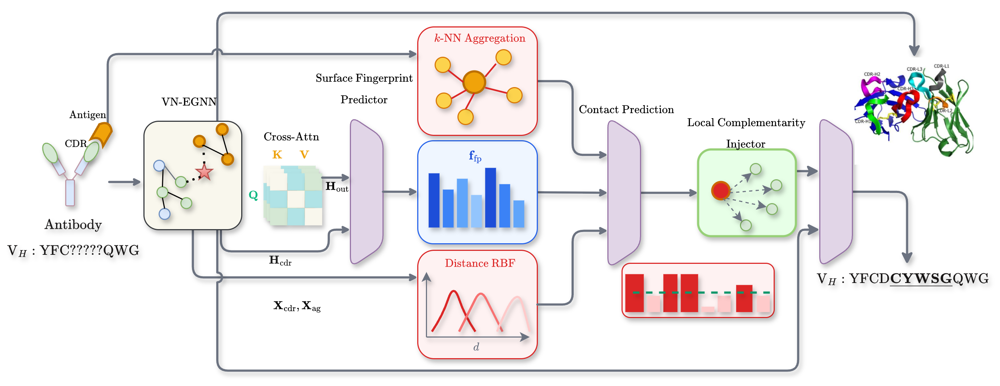

# CompFirst: Contact-First CDR Design

## Overview

CompFirst addresses **failure mode of no contact reasoning**: a contact-first architecture that explicitly predicts CDR-antigen contacts and uses these predictions to guide sequence and structure design.



## Directory Structure

```

trainer.py              # Main Hydra-based trainer
chimera_train.sh        # Training script (edit configs here)
utils.py                # Utilities
conf/                   # Hydra configs
├── config.yaml         # Main config (paths)
├── model/model.yaml    # Architecture & loss weights
├── training/training.yaml
├── dataset/dataset.yaml
├── callbacks/callbacks.yaml
└── wandb/wandb.yaml
model/                  # Model code
├── core.py             # DockDesigner (9.68M params)
└── modules.py          # VirtualNodeEGNN, RelationMPNN
data/                   # Data code
├── dataset.py          # FeatureDataset (105D pre-computed features)
├── germline_prior.py   # GermlinePrior (J,pos log-prior tables)
└── pdb_utils.py        # PDB utilities, VOCAB
evaluation/             # DDG evaluation helpers
```


## Usage

```bash
# Edit chimera_train.sh configs, then:
bash chimera_train.sh --gpu 0 --epochs 100

# Direct Python (Hydra)
python trainer.py
python trainer.py training.gpu=1 training.max_epoch=50

# Enable germline prior
python trainer.py model.use_germline_prior=true

# Test only (load checkpoint)
python trainer.py +training.test_only=true +training.checkpoint=/path/to/best.pt
```
